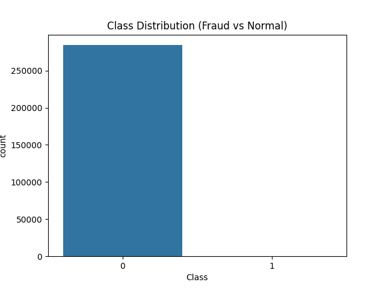
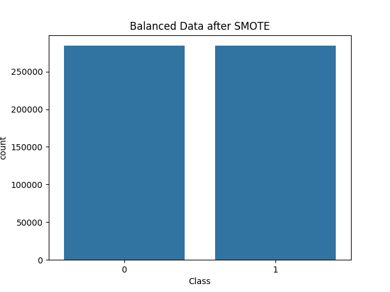

# 💳 Credit Card Fraud Detection

## 📌 About the Project
I worked on this project to understand how machine learning can be applied to detect fraudulent credit card transactions. The goal was to classify transactions as either **fraud** or **normal** based on transaction data.

---

## 📊 Dataset
The dataset contains anonymized features (V1–V28), along with:
- **Time** → Transaction time  
- **Amount** → Transaction amount  
- **Class** → Target variable  
  - 0 → Normal transaction  
  - 1 → Fraudulent transaction  

While exploring the data, I noticed that fraud cases were extremely rare compared to normal transactions.

---

## ⚠️ Challenge Faced
The dataset was highly imbalanced:
- Majority → Normal transactions  
- Minority → Fraud cases  

Because of this, accuracy alone was not a reliable metric for evaluation.

---

## 🔄 What I Did

### 🧹 Data Exploration
- Loaded and explored the dataset  
- Checked distribution of fraud vs normal transactions  
- Visualized imbalance using count plots  

---

### ⚖️ Handling Imbalance
To address the imbalance, I used:
- **SMOTE (Synthetic Minority Oversampling Technique)**  
  → Generated synthetic fraud samples to balance the dataset  

For faster experimentation, I also tried sampling smaller subsets.

---

### 🤖 Model Building
I trained a:
- **Random Forest Classifier**

This helped capture complex patterns in transaction data.

---

## 📈 Model Evaluation
Instead of relying on accuracy, I focused on:

- **Precision** → How many predicted frauds are actually correct  
- **Recall** → How many actual frauds were detected  
- **F1-score** → Balance between precision and recall  

This is important because missing fraud transactions can lead to financial loss.

---

## 📊 Visualizations

### Original Data (Imbalanced)

### After Applying SMOTE

---

## 🧠 Key Learnings
- Handling imbalanced data is critical in real-world problems  
- Accuracy can be misleading in fraud detection  
- Recall is more important when detecting fraud  
- Techniques like SMOTE improve model performance  

---

## 🛠️ Tools Used
- Python  
- Pandas  
- Scikit-learn  
- Seaborn & Matplotlib  
- imbalanced-learn (SMOTE)  

---
## 📈 Results

The model was evaluated using precision, recall, and F1-score.  
After handling class imbalance, the model showed significant improvement in detecting fraudulent transactions.

---

## 🚀 Final Thoughts
This project gave me hands-on experience with real-world challenges like imbalanced data and proper model evaluation. It also helped me understand how machine learning can be used in financial security systems.

---

## 👤 Author
Siddhi  

Open to feedback and suggestions 🙂
